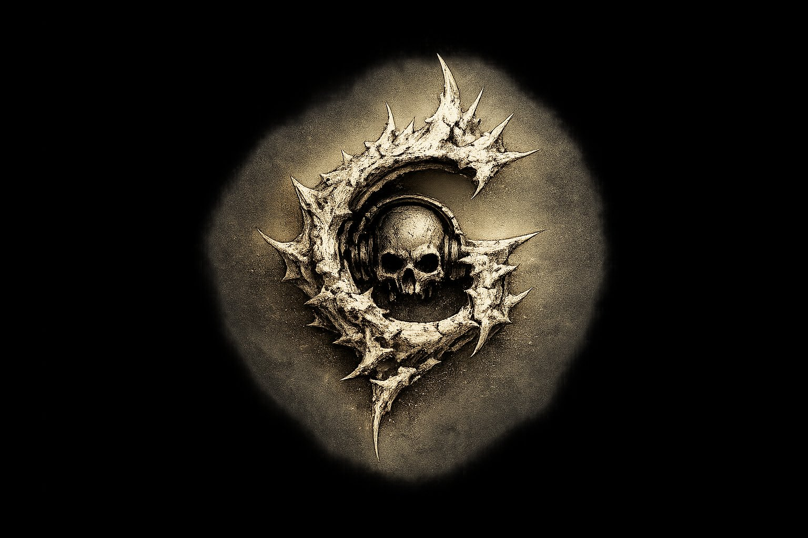

<p align="center">
  
</p>

# gool

[](https://github.com/siliconight/gool/actions/workflows/ci.yml)

A multiplayer-first audio middleware layer for Godot.

**Current version:** 0.18.0 — see [CHANGELOG.md](CHANGELOG.md) for what's
in it, [RELEASING.md](RELEASING.md) for how releases are cut.

## The problem

Online multiplayer games need things from audio that single-player
games don't. Godot doesn't ship them.

- **Voice chat.** Not LAN — real residential internet, with packet
  loss and inter-arrival jitter that don't behave nicely. Opus
  encoding, adaptive jitter buffer, packet-loss concealment,
  per-player telemetry. Godot has none of it. The de facto answer
  is "integrate Vivox" or "roll it yourself," and now you're
  maintaining a second audio path that doesn't talk to your
  positional system.
- **Replication-aware events.** A gunshot has different lifetimes
  for different listeners. The server fires it, the firing client
  predicts it locally, remote clients receive it via RPC, distant
  clients never hear it at all. Godot's audio nodes don't know
  the network exists — every replicated sound is a per-event RPC
  you wrote yourself.
- **Adaptive music.** Combat starts, music transitions. Not a
  hard cut, not a 3 dB power dip in the middle of a linear fade —
  equal-power crossfade, coordinated across every client in the
  session. Godot ships per-clip nodes; the state machine is yours
  to write.
- **Runtime mixing.** Player gunfire ducks music, ducks remote
  gunfire, ducks voice chat. Sidechain compression, hierarchical
  buses, snapshot-style state changes when the player ducks behind
  cover. Godot has linear `AudioBus` — one chain, no sidechains,
  no snapshots.
- **Scale.** A 32-player session with footsteps, ambient world,
  weapon fire, and dialogue easily hits 200+ active emitters at
  any moment. Godot pumps every active `AudioStreamPlayer3D`
  whether the listener can hear it or not. There's no native
  voice cap, no priority eviction, no interest management.
- **Replay determinism.** Spectator mode, esports replays,
  post-match clip recording, server-side debugging of "why did
  this play." The audio mix has to reproduce. Godot's audio
  pipeline uses wall-clock-derived timing in several places and
  isn't designed for bit-identical replay.

These aren't nice-to-haves. They're table stakes for online
multiplayer audio, and they're why FMOD and Wwise dominate that
tier of the market — at the cost of per-title licensing fees
and a separate authoring pipeline that lives outside your engine.

`gool` ships these as native Godot nodes. No licensing.
No second authoring tool. No parallel audio path.

## Where it fits

```
+---------------------------------------------+
|  Godot game                                 |
|  - rendering, scenes, input                 |
|  - networking (MultiplayerAPI)              |
|  - gameplay scripts (.gd / C#)              |
+----------------------+----------------------+
                       |  triggers events,
                       |  registers sounds,
                       |  drives listener
                       v
+---------------------------------------------+
|  gool middleware                            |
|  - drag-and-drop prefabs                    |
|  - replication-aware emitters               |
|  - voice chat (Opus + jitter buffer)        |
|  - bus graph + sidechain ducking            |
|  - adaptive music + crossfades              |
|  - asset pipeline (.gpak banks)             |
+----------------------+----------------------+
                       |  runtime audio
                       v
+---------------------------------------------+
|  Audio device                               |
|  (miniaudio: WASAPI / CoreAudio / ALSA)     |
+---------------------------------------------+
```

Godot continues to own the game world. `gool` owns the audio
runtime — what's playing, where, with what mix. Your gameplay
code tells `gool` "play X at Y" and `gool` handles the rest.

This replaces the need for FMOD Studio, Wwise, or a hand-rolled
OpenAL/SDL_mixer wrapper. You don't pay middleware licensing,
you don't run two audio systems in parallel, and your audio code
lives in Godot scripts instead of a separate authoring tool.

## How a typical workflow looks

1. **Designer authors a sound bank.** A JSON file lists sounds,
   groups (footstep variants), buses (music / sfx / voice / ambient),
   and attenuation curves. Assets get packed into a `.gpak` archive
   with the included `gpak_create` CLI.
2. **Game opens in Godot.** The `gool` editor plugin installs the
   `/root/Gool` autoload and registers the prefab Nodes. The sound
   bank loads once at startup.
3. **Gameplay scripts trigger events:**
   ```gdscript
   $WeaponFire.play("weapon_ak47", muzzle_position)   # NetworkedAudioEvent
   $Music.set_state("combat")                          # MusicStateController
   ```
4. **`gool` handles the runtime:** routes voices through the bus
   graph, replicates events to relevant peers via RPC, fades old
   music out and new music in with equal-power curves, applies
   sidechain ducking when gunfire fires, attenuates distant
   emitters, applies occlusion if the host's geometry query
   reports a wall in the way.
5. **Audio reacts dynamically.** No per-frame management code in
   your gameplay scripts.

The designer authors content. The gameplay engineer triggers
events. The middleware handles the rest.

## Quick start (Godot 4.2+)

> ### Setup
>
> Setup is documented in **[SETUP.md](SETUP.md)** — full per-platform
> instructions with troubleshooting. Three paths, easiest first:
>
> **Track A — Double-click installer (Windows, easiest).**
>
> 1. Right-click [**`gool-install.cmd`**](https://raw.githubusercontent.com/siliconight/gool/main/scripts/gool-install.cmd) → *Save link as…* → drop it into your Godot project folder (the one with `project.godot`)
> 2. Double-click it
>
> A console window opens, downloads the latest gool addon for Windows,
> extracts `addons/gool/` into your project, and tells you the project
> is ready. Open Godot — gool's C++ classes are immediately available.
> No terminal, no plugin enabling, no CMake or compiler. SmartScreen may
> prompt the first time (click *More info → Run anyway* — the file is
> unsigned because code-signing certificates cost real money for a free
> open-source project).
>
> **Track B — One-line install (Linux, macOS, or Windows terminal).**
>
> Run from inside your Godot project directory:
>
> ```powershell
> # Windows PowerShell:
> iwr -useb https://raw.githubusercontent.com/siliconight/gool/main/scripts/quickinstall.ps1 | iex
> ```
>
> ```bash
> # Linux / macOS:
> curl -sSL https://raw.githubusercontent.com/siliconight/gool/main/scripts/quickinstall.sh | bash
> ```
>
> Same outcome as Track A but works on every platform and doesn't need
> a file download first. Same script Track A's `.cmd` invokes
> internally.
>
> *Manual install* (if you'd rather not pipe a script): grab
> `gool-X.Y.Z-godot-addon-<platform>.{tar.gz,zip}` from the
> [Releases page](https://github.com/siliconight/gool/releases),
> extract `addons/gool/` into your Godot project, done.
>
> Linux x86_64, Windows x86_64, and macOS arm64 (Apple Silicon)
> supported.
>
> **Track C — Build from source** (for contributors, custom platforms,
> or if Track A/B's binary doesn't match your Godot version):
>
> ```bash
> git clone https://github.com/siliconight/gool.git && cd gool
> ./scripts/bootstrap.sh --install-to /path/to/your/godot/project
> ```
>
> One script verifies prerequisites, fetches dependencies, clones
> and builds godot-cpp, builds gool's GDExtension, and installs the
> addon into your project. Idempotent — safe to re-run. Windows
> users run `scripts\bootstrap.ps1 -InstallTo <path>` from the
> **x64 Native Tools Command Prompt for VS 2022**.
>
> Per-platform prerequisites (winget / Chocolatey for Windows,
> Homebrew for macOS, apt / dnf / pacman for Linux) and the manual
> phase-by-phase walkthrough are in [SETUP.md](SETUP.md).

### First lines of GDScript

Once the addon is enabled and `Gool` is autoloaded, four lines of
GDScript cover the most common cases:

```gdscript
Gool.play_3d("rifle_fire", global_position)
Gool.play_music_state("combat")
Gool.play_voice(player_id, audio_stream)   # AudioStreamWAV
Gool.set_rtpc("health", hp)
```

`play_3d` plays a registered sound at a world position. `play_music_state`
crossfades the music channel to a new state (lazily creates one on first
call). `play_voice` decodes an `AudioStreamWAV` to PCM and plays it as
voice for the given player. `set_rtpc` stores a real-time parameter
("health", "wetness", etc.) that authored sound definitions can
reference. Drop down to the lower-level API (`submit_event_local`,
`register_pcm_sound`, `submit_voice_packet`, `set_global_parameter`)
when these aren't enough.

To make `set_rtpc` actually drive audio, bind a sound's parameter target
to a global RTPC once, then call `set_rtpc` whenever the value changes:

```gdscript
# Heartbeat gets louder AND pitches up as health drops:
Gool.bind_volume_rtpc("heartbeat", "health", 0, 1, 1.0, 0.0)
Gool.bind_pitch_rtpc("heartbeat",  "health", 0, 1, 1.4, 1.0)

# Music ducks under combat with a smoothstep curve for an organic feel:
Gool.bind_rtpc("ambient_music", {
    "parameter": "combat_intensity",
    "target":    "volume",
    "curve":     "scurve",
    "min_value": 0.0, "max_value": 1.0,
    "min_output": 1.0, "max_output": 0.3,
    "smoothing_ms": 300.0,
})

# Later, every frame, just push the gameplay value:
Gool.set_rtpc("health", current_health / max_health)
Gool.set_rtpc("combat_intensity", combat_meter)
```

Four targets are supported: `volume`, `pitch`, `lowpass`, `reverb`. Four
curves: `linear`, `exponential`, `inverse_exp`, `scurve`. A sound can
have one binding per target simultaneously (volume + pitch + lowpass +
reverb each driven by their own parameter). Bindings can also be
declared in JSON sound banks via an `rtpc` array on each sound entry.

Skip-when-unset semantics: until `set_rtpc` is called once, bindings
have no effect — authored values stay in place.

### Try the example projects

For a complete working scene with all seven prefabs wired up
(adaptive music, spatial drone, footsteps, mock voice chat,
reverb zone, networked event, networked emitter), open
`examples/quickstart` in Godot and press Play.

For a more complete co-op shooter audio architecture demo —
single-host scene with a playable character + three AI bots,
three weapon types, footsteps for everyone, music that adapts to
gunfire intensity, ambient bed, and the full
replicate-gameplay-events / play-audio-locally pattern from
`docs/multiplayer.md` — open `examples/coop_shooter_template`.
That project is the proof the primitives compose into something
a Godot dev can build a co-op shooter on top of.

(Both example projects need a built GDExtension binary in their
own `addons/gool/bin/` directory, same way as your project.
SETUP.md covers this.)

## Who this is for

**Best fit:**
- Co-op shooters and extraction games
- Survival multiplayer (DayZ-style)
- Team-based competitive games (proximity comms + spatial gunfire)
- Social multiplayer (VRChat-style hubs)
- MMO-lite games (small-scale persistent worlds)

**Probably overkill for:**
- Single-player platformers
- Mobile arcade projects
- Visual novels and turn-based games
- Any project where Godot's built-in audio already meets your needs

## What you get

**For your players:**
- Proximity voice chat with adaptive jitter buffer
  (97.8% audible-frame continuity at 10% packet loss / 50 ms jitter,
  measured)
- Reactive music that crossfades smoothly between game-state tracks
- Spatial audio that sounds like real space — distance attenuation,
  Doppler, occlusion through walls, optional binaural HRTF
- Sidechain ducking that makes weapon fire feel weighty against music

**For your team:**
- Drag-and-drop Godot nodes (`AudioEmitter3D`, `VoiceChatPlayer`,
  `MusicStateController`, `ReverbZone`, `FootstepSurfacePlayer`,
  `NetworkedAudioEvent`, `NetworkedAudioEmitter3D`)
- JSON sound banks designers can edit without touching code
- Hot reload — change `sounds.json` on disk, the runtime
  re-registers without restart
- Familiar terminology — Events, Parameters, States, Buses,
  Snapshots — translated from FMOD/Wwise vocabulary

**For your production:**
- No middleware licensing fees
- Deterministic replay — bit-identical sample output across runs
  given identical input timelines (verified)
- Bandwidth-aware replication — distance + team based RPC filtering
- Lock-free, allocation-free render thread (the engine never
  allocates or takes a lock during audio rendering)

## Why not Godot's built-in audio?

The gap is concrete:

| Concern                       | Godot built-in                  | gool                                            |
|-------------------------------|---------------------------------|-------------------------------------------------|
| Voice chat                    | external SDK required           | included (Opus + adaptive jitter buffer + PLC)  |
| Replication-aware events      | manual RPC per sound            | three replication patterns built in             |
| Adaptive music                | per-clip state machines         | `MusicStateController` prefab + crossfade       |
| Asset pipeline                | per-clip imports                | JSON sound banks + `.gpak` archives             |
| Bus graph + sidechain         | linear audio buses              | hierarchical buses with sidechain compressor    |
| Replay determinism            | not addressed                   | bit-identical mix output verified               |
| Per-event priority + eviction | first-come-first-served voices  | priority + distance-based eviction              |

Godot's audio is appropriate for projects that don't need any of
the above — single-player, small co-op, anything where a few
positional emitters and a linear bus tree are the whole story.
The moment you need any one row of that table, you're shopping
for middleware. `gool` is the option that doesn't make you leave
Godot to find it.

---

## Open by design — and AI-readable

Open source isn't just a license tier; it's an integration model. When
the engine surprises you, you can read the code that produced the
surprise. When the README claims "97.8% audible-frame continuity at
10% loss / 50 ms jitter," you can open
[`tests/unit/jitter_buffer_test.cpp`](tests/unit/jitter_buffer_test.cpp)
and check the methodology. When you need behavior the engine doesn't
yet ship — a custom spatializer, a different priority-eviction policy,
a specialized voice codec — the seams are there and the existing
implementations sit right next to them as worked examples. The
[Apache 2.0 license](LICENSE) covers forking the whole thing if you
need to take it further.

Closed middleware is a black box by necessity: vendor support is the
only debug path, and what the docs cover is what you get. Both models
work for different teams. An indie shipping their first multiplayer
title usually benefits more from "I can step into this in my debugger
and read the comments" than from "I can file a P3 bug with a vendor."

### What changes in the AI-tooling era

Open code compounds with AI-assisted engineering. Coding agents (Claude
Code, Cursor, Copilot, etc.) can read the engine's full implementation,
understand its architecture, and generate integration code against the
actual API surface — not just public docs. With this codebase in
context, an agent can:

- **Implement an `IAudioBackend`** against your existing audio output
  layer, matching the patterns in `NullAudioBackend` and
  `MiniaudioBackend`.
- **Write tests for your specific packet pattern** by reading
  [`docs/multiplayer.md`](docs/multiplayer.md) and the existing
  jitter-buffer tests as worked examples.
- **Trace surprising behavior** through the actual code path
  (`SubmitEvent` → `Update` → drain → spatializer → mixer command →
  render thread) rather than guessing from API names.
- **Propose a fix** to a bug it can see firsthand, with the trade-offs
  visible in code rather than reverse-engineered from a stack trace.

With closed middleware the agent works from headers and public docs
only. It can scaffold integration, but it can't verify its own
suggestions against the implementation, and it can't propose fixes
for behavior it can't see.

---

## Reader-specific guides

### For gameplay engineers

You trigger sounds from gameplay scripts. The contract is small:
register sounds at startup, fire events at gameplay moments, set
listener position from your camera each frame.

- **API surface:** the `/root/Gool` autoload + the seven prefab Nodes
  (see `godot/addons/gool/`)
- **Replication patterns:** [`docs/replication_patterns.md`](docs/replication_patterns.md)
  — server-authoritative vs. client-predicted vs. client-authoritative
- **Multiplayer integration:** [`docs/multiplayer.md`](docs/multiplayer.md)
  — wiring into Godot's MultiplayerAPI, Steam GameNetworkingSockets, ENet
- **Predictive playback:** [`docs/predictive_playback.md`](docs/predictive_playback.md)
  — when to predict locally, when to wait for server confirmation

### For audio designers

You author content in a JSON sound bank, pack it into a `.gpak`,
and tweak parameters in the Godot inspector or hot-reload at
runtime.

- **Sound bank schema:** [`docs/asset_pipeline.md`](docs/asset_pipeline.md)
  — JSON format, group selection policies, hot reload
- **Terminology:** [`docs/terminology.md`](docs/terminology.md)
  — gool's vocabulary aligned with FMOD/Wwise so muscle memory
  transfers
- **Migration from FMOD:** [`docs/migration_from_fmod.md`](docs/migration_from_fmod.md)
- **Migration from Wwise:** [`docs/migration_from_wwise.md`](docs/migration_from_wwise.md)

### For network/infrastructure engineers

You care about bandwidth, determinism, and what runs on which
thread.

- **Determinism:** [`docs/determinism.md`](docs/determinism.md)
  — what's deterministic, what isn't, how to set up bit-identical replay
- **Bandwidth:** RPC filtering via the included `AudioRelevancyFilter`;
  per-event priority + late-event staleness
- **Threading:** four roles enforced via Clang Thread Safety
  Analysis; render thread does no allocations, no locks, no
  syscalls, no exceptions. See [Engine architecture](#engine-architecture)
  in the Reference.
- **Telemetry:** `IRuntimeTelemetrySink` seam plus three built-in
  sinks (JSON Lines, Prometheus exposition, in-memory ring buffer
  for time series). Wires the runtime's `Stats` snapshot into your
  observability stack at a configurable cadence. See
  [`examples/telemetry/main.cpp`](examples/telemetry/main.cpp) for a
  working integration that produces a Prometheus `/metrics` body
  verbatim.
- **Event-level logging:** `IRuntimeLogSink` seam plus JSON Lines
  and ring-buffer sinks. Telemetry tells you *that* a counter
  moved; logging tells you *why*. Hook points fire on late-event
  discard, RTPC budget exceeded, one-shot drops/evictions,
  replication policy/validator/rate-limit rejections, and
  render-thread underrun delta detection. Configurable
  `logMinLevel`; disabled categories cost a branch, not a sink
  call. See
  [`include/audio_engine/logging.h`](include/audio_engine/logging.h).

---

## Reference

The rest of this document is technical reference for engineers
integrating, modifying, or extending the engine itself. The
sections above are what most readers need.

### Building the engine library directly

The engine is also usable as a standalone C++20 library outside
of Godot. The library namespace is `audio`, the CMake target is
`audio_engine`. Full per-platform build instructions are in
[SETUP.md](SETUP.md); the short version:

```bash
git clone https://github.com/siliconight/gool.git && cd gool
./scripts/fetch_miniaudio.sh && ./scripts/fetch_decoders.sh
cmake -S . -B build && cmake --build build -j
ctest --test-dir build                          # 36 unit tests
```

That builds a static library and the test suite using the silent
`NullAudioBackend`. To hear audio from C++ examples (not via
Godot), enable the miniaudio backend:

```bash
cmake -S . -B build -DAUDIO_ENGINE_BACKEND_MINIAUDIO=ON
cmake --build build -j
./build/examples/audio_engine_hello_audio       # 1-second 440 Hz tone
```

### Build options

| Option                              | Default | Effect                                     |
|-------------------------------------|---------|--------------------------------------------|
| `AUDIO_ENGINE_BUILD_TESTS`          | ON      | Build unit tests (`tests/unit/`)           |
| `AUDIO_ENGINE_BUILD_EXAMPLES`       | ON      | Build examples (`examples/`)               |
| `AUDIO_ENGINE_BACKEND_MINIAUDIO`    | ON      | Cross-platform device output via miniaudio |
| `AUDIO_ENGINE_DECODERS_WAV`         | ON      | WAV file decoding (dr_wav)                 |
| `AUDIO_ENGINE_DECODERS_OGG`         | ON      | Ogg Vorbis decoding (stb_vorbis)           |
| `AUDIO_ENGINE_DECODERS_FLAC`        | ON      | FLAC decoding (dr_flac)                    |
| `AUDIO_ENGINE_VOICE_OPUS`           | OFF     | Opus codec for voice chat (libopus)        |
| `AUDIO_ENGINE_DECODERS_OPUS`        | OFF     | Ogg Opus file decoding (libopusfile)       |
| `AUDIO_ENGINE_SHARED`               | OFF     | Build as shared library                    |

The audio backend + WAV/OGG/FLAC decoders default ON because the
overwhelmingly common use case (Godot adopter, C++ game embedding the
engine) wants them. They're zero-system-dependency: miniaudio,
dr_wav, dr_flac, and stb_vorbis are all single-header drops fetched
on demand by `scripts/fetch_*.{sh,bat}` or by CMake's `FetchContent`
fallback (controlled by `AUDIO_ENGINE_FETCH_*=ON`, also default).

To opt out — for a minimal embedded-engine build, an audio analysis
tool, or an air-gapped checkout where FetchContent can't reach the
network — pass the inverse: `-DAUDIO_ENGINE_BACKEND_MINIAUDIO=OFF
-DAUDIO_ENGINE_DECODERS_WAV=OFF -DAUDIO_ENGINE_DECODERS_OGG=OFF
-DAUDIO_ENGINE_DECODERS_FLAC=OFF`. The C++ static library released
on the GitHub Releases page (`gool-X.Y.Z-PLATFORM.tar.gz` — distinct
from the Godot addon archive) is built this way, since C++ embedders
typically want minimal.

`AUDIO_ENGINE_VOICE_OPUS` and `AUDIO_ENGINE_DECODERS_OPUS` stay OFF
by default in CMakeLists.txt. Voice chat brings in libopus
(CMake-friendly, but non-trivial build time via FetchContent if not
vendored). `.opus`-file playback brings in libopusfile (autotools,
no FetchContent path — has to come from the system package manager:
`apt install libopusfile-dev` / `brew install opusfile` / `vcpkg
install opusfile`). The Godot release pipeline enables both on all
three shipping platforms automatically (Linux via apt, macOS via
brew, Windows via vcpkg with the `x64-windows-static-md` triplet so
the libs link statically into the addon DLL with no extra runtime
deps). Standalone-library users opt in by hand.

### Dependencies

| Required        | Notes                                              |
|-----------------|----------------------------------------------------|
| C++20 compiler  | g++ 10+, Clang 11+, MSVC 19.29+ all work           |
| CMake 3.20+     | Specified in root `CMakeLists.txt`                 |
| pthreads        | `find_package(Threads REQUIRED)`                   |

| Fetched (single-header drops, all public-domain or MIT-0; not vendored)         |
|--------------------------------------------------------------------------------------|
| miniaudio (cross-platform audio device I/O) — `scripts/fetch_miniaudio.{sh,bat}`     |
| dr_wav, dr_flac (lossless decoders) — `scripts/fetch_decoders.{sh,bat}`              |
| stb_vorbis (Ogg decoder) — `scripts/fetch_decoders.{sh,bat}`                         |

The fetch scripts download from upstream GitHub and set the files
read-only after download. `AUDIO_ENGINE_FETCH_DECODERS=ON` (the
default) also makes CMake fall back to `FetchContent` if the files
aren't already present, so you can skip the scripts in CI.

| System-package optional dependencies                                     |
|---------------------------------------------------------------------------|
| `libopus` — voice chat encode/decode (BSD-3-Clause), opt-in via           |
| `AUDIO_ENGINE_VOICE_OPUS=ON`. Resolved via vendored, system find_package, |
| pkg-config, or FetchContent fallback.                                     |
| `libopusfile` — `.opus` file decoding (BSD-3-Clause), opt-in via          |
| `AUDIO_ENGINE_DECODERS_OPUS=ON`. Resolved via system find_package or      |
| pkg-config; install via apt / brew / vcpkg (see [SETUP.md](SETUP.md)).    |

### Engine architecture

Four polymorphism seams, no more:

| Seam                  | Default                              | Replace when…                       |
|-----------------------|--------------------------------------|-------------------------------------|
| `IAudioBackend`       | `NullAudioBackend` (silent)          | Always for shipping                 |
| `IAudioGeometryQuery` | `NullGeometryQuery` (always clear)   | You want occlusion to reflect walls |
| `ISpatializer`        | `DefaultSpatializer` (pan + LPF)     | You want HRTF                       |
| `IVoiceCodec`         | `StubVoiceCodec` (PCM passthrough)   | Network-shipped voice chat          |

Four threads, encoded in the type system via Clang Thread Safety
Analysis (`thread_annotations.h`):

| Thread  | Owns                                                                    |
|---------|-------------------------------------------------------------------------|
| Game    | `Update`, `CreateEmitter`, `SetEmitterTransform`, `SubmitEvent`          |
| Network | `OnTickAdvanced`, `SubmitReplicatedEvent`, `OnVoicePacket`               |
| Control | Internal — drains rings, runs orchestrator, posts mixer commands         |
| Render  | Internal — backend-driven; pulls mixer commands, mixes into device buffer|

The render thread does no allocations, no locks, no syscalls, no
exceptions. Enforced architecturally via the SPSC mixer command
ring; tested via the kitchen-sink integration test.

Memory is pre-sized once at `Initialize()` from `AudioConfig`,
never resized. Slot-map handles with generation counters
(`handles.h`) detect use-after-free of recycled slots.

### Subsystems

Each ships with measured numbers and the design intent behind
the choice. Test coverage for each subsystem lives in
`tests/unit/`.

#### Spatial

Distance attenuation (linear / logarithmic / inverse-square),
equal-power pan, Doppler with per-voice pitch smoothing,
distance-driven air absorption, per-voice biquad LPF for
occlusion damping with material-aware defaults
(`Concrete`, `Curtain`, `Glass`, etc.).

Optional `SphericalHeadSpatializer` adds binaural cues:
Woodworth ITD plus head-shadow ILD. Pinna spectral cues are not
modelled; `ISpatializer` is the seam for an HRIR-convolution
implementation when needed.

Verified: peak 0.500 → 0.004 (≈42 dB) when occluded;
2π·f·A/sr-accurate Doppler resampling; ITD 31.48 samples at full
lateral matching the textbook spherical-head value within half a
sample.

#### Music

Equal-power crossfade (`cos`/`sin` curves) on `fadeInMs` and
`DestroyEmitter(handle, fadeOutMs)`. Total RMS held within ±0.3%
of baseline through a 300 ms A→B transition.

`MusicChannel` helper handles the canonical two-track crossfade.
`MusicStateController` Godot prefab wraps it with a named-state
API: `set_state("combat")`.

`SetEmitterPlaybackSpeed(handle, speed)` is tape-style (pitch +
tempo coupled). Verified: 1.5× speed produces 1.500× fundamental
frequency (zero-crossing ratio).

Loop-boundary crossfade via `SoundDefinition.loopCrossfadeMs`
eliminates the click on imperfectly-authored loops. **158×
reduction** measured on a worst-case discontinuous source; zero
overhead on perfectly-authored loops.

#### Voice chat

Opus codec wrapper (FEC, complexity 5, 32 kbps VBR), per-player
decoder pool with LRU eviction. **Adaptive jitter buffer** with
RFC 3550 inter-arrival jitter estimation and adaptive target
depth. Packet-loss concealment via libopus PLC.

Verified continuity on real-internet conditions:

| Scenario                               | Continuity | Observed jitter |
|----------------------------------------|-----------:|----------------:|
| Clean LAN (0% loss, 1 ms jitter)       |     100.0% |            0 ms |
| Residential (5% loss, 30 ms jitter)    |     100.0% |           21 ms |
| Rough internet (10% loss, 50 ms jitter)|  **97.8%** |           29 ms |
| Burst loss (200 ms outage)             |     100.0% |            0 ms |

Throughput: ~65 million push+pop ops/sec on commodity x86_64.
Zero allocations on the hot path; per-pop work is O(capacityDepth)
atomic loads plus one memcpy.

Per-player telemetry surfaces every counter via
`runtime.GetVoiceNetworkStats(playerId, &stats)`:
`packetsAccepted`, `packetsLost`, `plcGenerated`, `observedJitterMs`,
`targetBufferDepthFrames`, etc.

#### Asset pipeline

JSON sound banks with FNV-1a hashed IDs. Three group selection
policies: `random`, `random_no_repeat`, `sequential`. Hot reload
via `bank.Reload(runtime)` re-registers everything; IDs are
hashes of names so in-flight emitters keep working across
reloads.

`.gpak` archive format (uncompressed binary, 24-byte header +
concatenated payloads + index). `PakReader::MakeSoundBankLoader()`
returns a callback that plugs straight into
`SoundBankLoadOptions::fileLoader`. Standalone `gpak_create` CLI
under `tools/`.

Cost: 1000-entry bank loads in 0.6 ms; `Find()` runs at 18.5 M
ops/sec.

#### Bus graph and sidechain ducking

Hierarchical buses with per-bus effect chains. Effects shipped:
gain, biquad EQ (LP / HP / BP / low-shelf / high-shelf /
parametric peak — RBJ cookbook coefficients, ±0.05 dB out-of-band
accuracy), sidechain compressor (with soft knee, parallel mix,
range cap, sidechain HPF, hold timer, and switchable RMS/Peak
detection), tanh saturation waveshaper for subtle bus glue and
hit reinforcement, and a Freeverb-derived reverb send.

The L4D2 multi-tier ducking pattern (local gun > nearby remote
gun > music) composes from primitives: hierarchical buses plus
sidechain compressors keyed off a `LocalSfx` bus. See
`examples/multi_tier_ducking/` for a runnable end-to-end example.

Baseline measured at -17.20 dB before ducking, -32.0 dB at
deepest duck, ~250 ms recovery. Reproduces at every CI run.

#### Effect profiles

Two header-only profile libraries ship curated, opinionated
parameter bundles for common game-audio scenarios. Each profile
is one `inline constexpr` function returning a populated
`EffectConfig`. Drop them straight into a bus's effect chain;
the one parameter every profile takes is `thresholdDb` (or
`drive` for saturation), because that's the one value that
genuinely depends on host loudness targets. Override anything
else after the call.

```cpp
#include "audio_engine/compressor_profiles.h"
#include "audio_engine/saturation_profiles.h"

bus.effects.push_back(audio::CompressorProfiles::VoiceSmoothing());
bus.effects.push_back(audio::SaturationProfiles::BusGlue());
```

`compressor_profiles.h` covers nine profiles across four families:
**punch** (`DrumBusPunch`, `FootstepGlue`, `GunshotSnap`),
**impact** (`ExplosionImpact`, `BassImpact`),
**glue / smoothing** (`MasterBusGlue`, `VoiceSmoothing`), and
**sidechain duckers** (`MusicDuckUnderVoice`, `MusicDuckUnderSfx`).

`saturation_profiles.h` covers five profiles: `BusGlue`,
`DialogueWarmth`, `WeaponBody`, `ImpactCharacter`, and
`TapeColor`. Drives stay in 1.3–4.0 and mixes in 0.10–0.45 — the
intent is light enhancement, not heavy distortion. Anything more
aggressive belongs in the DAW.

Numbers come from common production-engineering rules of thumb
(Wwise default templates, FMOD Studio presets, mastering-engineer
guidance). Where two sources disagreed, the safer choice ("never
destructive") was taken. These are starting points, not religion.

Profile libraries are intentionally additive — the menu will grow
as more game-audio scenarios get a "we use this every project"
recipe (vehicle-engine compression, cinematic-trailer hits, UI
feedback shaping, ambience layering). Hosts can also build their
own profile namespace by following the same pattern: a constexpr
function returning a populated `EffectConfig`.

#### Multiplayer

Network-thread entry points:

```cpp
runtime.OnTickAdvanced(simTick, serverTimeMs);
runtime.SubmitReplicatedEvent(event);
runtime.UpdateReplicatedTransform(handle, pos, fwd, vel, simTick);
runtime.OnVoicePacket(playerId, bytes, size, seq, sendTs, arrivalTs);
```

Per-event staleness override (item-driven; gunshots fall stale at
~200 ms, music transitions at 5 s, UI never).
`CancelPredictedEvent(predictionId, fadeMs)` for client-side
prediction reconciliation. Interest management caps per-tick
spatializer work at `maxActiveEmittersProcessedPerTick` —
out-of-set emitters get a single zero-gain update and the mixer
voice continues running silently.

The 6-arg `OnVoicePacket(... arrivalMs)` overload accepts an
explicit arrival timestamp; combined with deterministic
`OnTickAdvanced`, the engine produces bit-identical sample
output across runs given identical input timelines. Verified
end-to-end in `tests/unit/replicated_events_test.cpp`.

#### Voice cap and priority eviction

Effective priority is `(priority << 32) - distance_to_listener_mm`.
Priority dominates; within a priority tier, closer-to-listener
wins. Persistent emitters (host-owned via `CreateEmitter`) are
immune. Only one-shots compete for slots. Stats surface
`oneShotEvictions` and `oneShotsDroppedFullPool` so you can size
the pool to your gameplay.

#### Decoders and streaming

WAV / Ogg Vorbis / FLAC via single-header decoders. Sub-second
SFX path goes through `RegisterSoundFromFile` (decoded fully,
pinned in memory). Long material (music, dialogue, ambience)
goes through `RegisterStreamingSoundFromFile` with a per-asset
SPSC ring; the control thread tops up the ring in 2048-frame
chunks, the render thread drains it.

### Layout

```
audio_engine/
├── CMakeLists.txt
├── include/audio_engine/        # public headers
├── src/audio_engine/            # internal implementation
│   ├── runtime/                 # AudioRuntime + Impl
│   ├── emitters/                # slot map + SoA mirror
│   ├── voice/                   # voice sources, jitter buffer, codecs
│   ├── spatial/                 # spatializers + occlusion
│   ├── mixer/                   # SPSC-driven render mixer + bus graph
│   ├── dsp/                     # gain, biquads, compressor, reverb
│   ├── decoders/                # WAV / Ogg / FLAC + resampler
│   ├── backend/                 # NullAudioBackend, MiniaudioBackend
│   └── assets/                  # AudioAssetRegistry, SoundBank, Gpak
├── examples/                    # ducking, streaming, sound_bank,
│                                # music_crossfade, hello_audio,
│                                # multi_tier_ducking, quickstart (Godot)
├── tests/unit/                  # 25 tests covering every subsystem
├── godot/                       # GDExtension binding + addons + prefabs
├── tools/gpak_create/           # CLI for packing assets
└── docs/                        # asset_pipeline, multiplayer,
                                  # determinism, predictive_playback,
                                  # replication_patterns, terminology,
                                  # migration_from_fmod, migration_from_wwise
```

### Test suite

36 unit tests in `tests/unit/`, all wired into CTest and the CI
matrix. Headline coverage:

| Test                            | Validates                                                  |
|---------------------------------|------------------------------------------------------------|
| `bus_graph_test`                | Bus graph topology + render order + sidechain resolution   |
| `compressor_test`               | Sidechain compressor static curve + envelope follower      |
| `priority_eviction_test`        | Voice cap + priority-based eviction                        |
| `occlusion_lpf_test`            | Per-voice biquad LPF for material-aware occlusion          |
| `doppler_smoothing_test`        | Doppler ratio + per-voice pitch smoothing + linear interp  |
| `air_absorption_test`           | Distance-driven HF rolloff                                 |
| `reverb_send_test`              | Per-voice reverb send + opt-out paths                      |
| `binaural_spatializer_test`     | ITD / ILD math + L/R symmetry + end-to-end runtime         |
| `voice_codec_test`              | Opus encode/decode + PLC + sequence reorder                |
| `jitter_buffer_test`            | Adaptive jitter buffer continuity under loss + jitter      |
| `voice_telemetry_test`          | Per-player stats accuracy                                  |
| `production_readiness_test`     | Material differentiation + one-shot grace + fade-out       |
| `multiplayer_readiness_test`    | Per-event staleness + CancelPredictedEvent + interest mgmt |
| `sound_bank_test`               | JSON parser + group policies + hot reload                  |
| `crossfade_test`                | Equal-power music crossfade + power-conservation           |
| `loop_crossfade_test`           | Loop-boundary crossfade click reduction                    |
| `biquad_eq_test`                | LP/HP/BP/Shelf/Peak frequency response                     |
| `gpak_test`                     | Pack format round-trip + malformed rejection               |
| `determinism_test`              | Bit-identical replay across runs                           |
| `replicated_events_test`        | SubmitReplicatedEvent + Cancel deterministic across runs   |
| `replication_rate_limit_test`   | Per-player + per-category token-bucket rate limiter, IReplicationValidator hook, voice path rate limit, new-id-cycling defense, source/policy enforcement, deterministic across runs |
| `default_bounds_validator_test` | DefaultBoundsValidator rejects NaN/Inf vec3, extreme magnitudes, malformed parameters, unknown soundIds; ChainReplicationValidator short-circuits |
| `version_test`                  | `audio::GetVersion()` returns the pinned version triple; catches drift between version.h and CMakeLists |
| `global_parameter_test`         | RTPC store: HashParameterName stable + collision-aware, set/get/clear, budget enforced only on new IDs, NotInitialized + InvalidArgument paths |
| `sound_rtpc_test`               | Render-thread RTPC modulation: Volume / Pitch / LowPass / multi-binding / linear+exp+inv-exp+scurve curves; audibility-verified end-to-end |
| `telemetry_test`                | Telemetry sinks: JSON Lines / Prometheus exposition / in-memory ring buffer; runtime emit cadence; null-safety paths |
| `logging_test`                  | Event-level structured logging: JSON Lines + Ring sinks, level filtering, end-to-end hook points (RTPC budget exceeded, replication policy violation, late-event discard) firing from real runtime code paths |
| `integration_kitchen_sink_test` | 5-second simulation with all subsystems active             |

CI runs the full suite on Ubuntu and Windows on every push. The
ducking baseline (-17.20 dB) is reproduced at every run.

### Roadmap

Where this is going next is documented in
[`docs/roadmap.md`](docs/roadmap.md): four phases (adoptable,
production-safe, designer-first, platform), 28 work items, sized
and ordered by leverage. The roadmap is the canonical answer to
"is X coming" — file an issue if your X is missing or
mis-prioritized.

### License

Apache License 2.0. See [LICENSE](LICENSE).

Vendored single-header dependencies are public-domain or MIT-0;
optional libopus is BSD-3-Clause.
